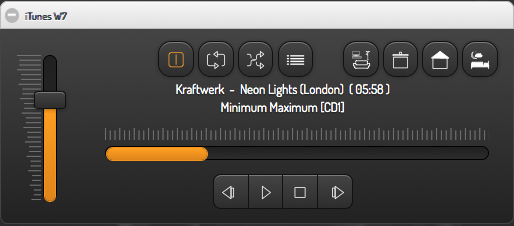

### Media Player (iTunes(r)) and Amplifier Widgets for smartVISU / FHEM

Screenshots:




Installation hints:

- Copy widget_media.* to your pages folder

- Add CSS code from widget_hue.css to your visu.css or include it any other way

- Code for your room.html or category.htm:

```


<div class="block" style="width: 100%;">
	<div class="set" data-role="collapsible-set" data-theme="c" data-content-theme="a" data-mini="true">
		<div data-role="collapsible" data-collapsed="false" >
		<h3>Amp Wohnzimmer (Yamaha DSP-Z7)</h3>
		<table style="width: 100%;">
			<tr><td>
				{{ media.amp('wz_amp', 'WZ_AMP', [ ['cbl/sat','SAT'], ['dvd','iTunes'], ['cd','CD'], ['dvr','DVR'] ]) }}
			</td></tr>
		</table>
		</div>
	</div>
</div>

<div class="block" style="width: 100%;">
	<div class="set-4" data-role="collapsible-set" data-theme="c" data-content-theme="a" data-mini="true">
		<div data-role="collapsible" data-collapsed="false" >
		<h3>iTunes W7</h3>
		<table width="100%">
			<tr><td> {{ media.itunes('iTunes', 'iTunes', [['airplay1','scene_livingroom.svg'],['airplay2','scene_cooking.svg'],['airplay3','scene_sleeping.svg']]) }}</td></tr>
		</table>
		</div>
	</div>
</div>
```
